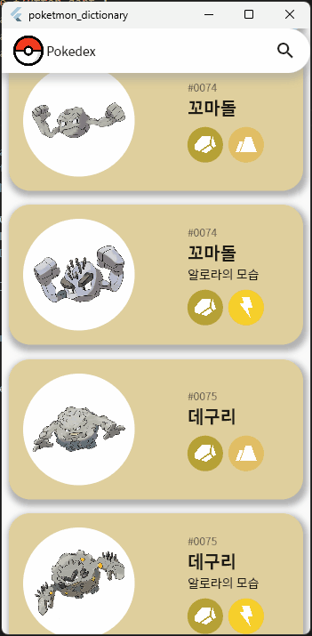

# pokemon_dictionary

[스토어](https://play.google.com/store/apps/details?id=com.wookhyun.poketmon_dictionary&hl=en-KR)

## 사용한 라이브러리

- flutter_riverpod, 상태관리 라이브러리
- riverpod_annotation, 상태관리 라이브러리(지금까지는 안쓴듯)
- dio, 통신 라이브러리
- html, html parser를 위한 라이브러리
- lottie, image loading 시 사용하기 위한 애니메이션 라이브러리
- go_router, router용

### 특징

#### 반응형 디자인 적용

<table>
    <tr>
        <td> 일반 스마트폰
            </td>
            <td> 태블릿(너비가 더 큰 플랫폼)
        </td>
    </tr>
        <tr>
        <td>
        
        </td>
        <td>
        
        </td>
    </tr>
</table>

#### 1.0.0+2 2023-03-19

- 포켓몬 타입 null처리 수정

#### 1.0.1+3 2023-04-11

- local DB Hive 추가
- cache image widget 추가
- search app bar 및 korean regex 적용

